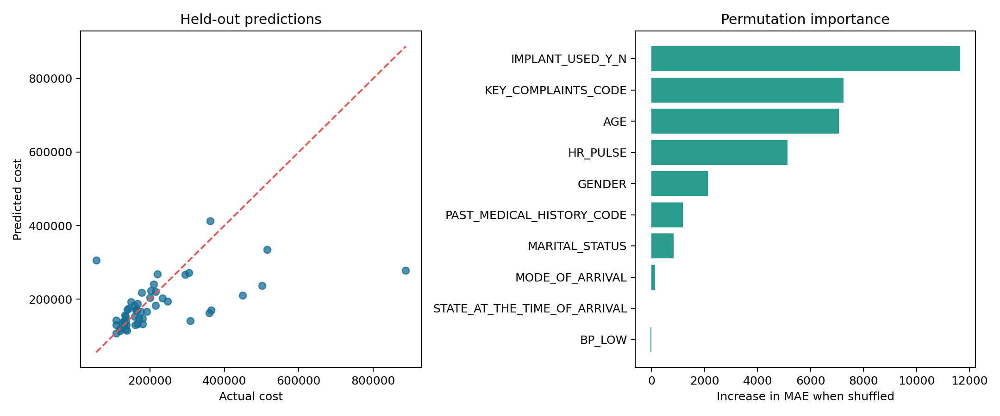

# Hospital Cost Prediction at Admission

An end-to-end machine learning case study that estimates a patient's total hospital
cost from information available at admission. The project emphasizes the parts of
data science that matter in production and in interviews: a clearly scoped problem,
leakage prevention, reproducible preprocessing, baseline comparison, honest
validation, uncertainty communication, and a usable Streamlit demo.

> Educational portfolio project only. It is not a clinical, billing, or pricing tool.

[](https://hospital-cost-estimator-nicky.streamlit.app/)

**Live demo:** [hospital-cost-estimator-nicky.streamlit.app](https://hospital-cost-estimator-nicky.streamlit.app/)

## Why this project is worth discussing

- **Business framing:** supports an early cost estimate when the patient arrives.
- **Leakage-aware features:** excludes realized length of stay and realized implant
  cost, which are unavailable at prediction time.
- **Reproducible ML pipeline:** imputes missing values, one-hot encodes categories,
  log-transforms the skewed target, and handles unseen categories.
- **Honest model selection:** compares a median baseline, Ridge regression, and a
  random forest using five-fold cross-validation on the training split only.
- **Original-unit evaluation:** reports MAE/RMSE in currency, not only on the log scale.
- **Responsible communication:** displays a data-driven error band and clearly states
  limitations of the small, single-hospital dataset.
- **Engineering hygiene:** includes tests, one-command workflows, generated data-quality
  and subgroup reports, plus a ready-to-enable CI workflow.

## Results

Ridge regression narrowly beat the random forest during cross-validation. On the
untouched 50-admission test set, it improved MAE by **27.4%** over the median baseline.

| Model | Validation MAE | Test MAE | Test R² |
| --- | ---: | ---: | ---: |
| Median baseline | ₹81,083 | ₹83,656 | -0.021 |
| Ridge (selected) | **₹59,046** | **₹60,734** | **0.235** |
| Random forest | ₹60,451 | — | — |

Validation values are five-fold means on the 198-row training split. The fixed 20%
held-out set is used once after model selection. The diagnostic plot shows that the
model tends to underpredict rare, very high-cost admissions—an important limitation,
not a production-ready result.

Run the training command below to regenerate `outputs/metrics.json`, the serialized
pipeline, feature importance table, and diagnostic chart.



## Repository structure

```text
app/app.py                       Streamlit prediction demo
data/mission_hospital.xlsx       Source case-study workbook
notebooks/01_data_understanding.ipynb  Exploratory analysis
src/hospital_pricing/data.py     Loading, cleaning, feature contract
src/hospital_pricing/modeling.py Preprocessing and model candidates
src/hospital_pricing/train.py    CV selection, test evaluation, artifacts
tests/                           Data and pipeline tests
outputs/                         Metrics and diagnostic artifacts
docs/MODEL_CARD.md               Intended use, evaluation, and limitations
docs/INTERVIEW_GUIDE.md          Concise recruiting-season talking points
docs/CI_WORKFLOW.yml             Ready-to-enable test and reproducibility workflow
```

## Run locally

```bash
python -m venv .venv
source .venv/bin/activate
pip install -e ".[dev]"
python -m hospital_pricing.train
pytest
streamlit run app/app.py
```

Or use `make install`, `make check`, and `make app` for the same workflow.

The small trained model artifact is versioned so the deployed demo starts immediately.
The training command regenerates it along with the metrics and plots; dependency
ranges are constrained to keep serialization compatible.

## Modeling decisions

The target is strongly right-skewed, so Ridge and random forest candidates learn
`log1p(total cost)` through `TransformedTargetRegressor` and return predictions in the
original unit. All imputation and encoding are fitted inside each cross-validation
fold, preventing validation data from influencing preprocessing.

Permutation importance is calculated on the held-out set and measures how much MAE
worsens when an input is shuffled. This is more comparable across mixed feature types
than raw tree importance, though estimates are noisy with only 50 test observations.

Generated evaluation artifacts include:

- `outputs/data_quality.json` for missingness, duplicates, and target quantiles
- `outputs/subgroup_metrics.csv` for held-out MAE and bias across selected slices
- `outputs/feature_importance.csv` for permutation importance
- `outputs/metrics.json` for machine-readable validation and test metrics

See the [model card](docs/MODEL_CARD.md) for intended use and the
[interview guide](docs/INTERVIEW_GUIDE.md) for a concise project narrative.

## Limitations and next steps

- Only 248 admissions from one hospital are available; external validity is unknown.
- Rare high-cost admissions are systematically underpredicted in the held-out sample.
- Random splitting does not test temporal or site-level drift because dates and other
  hospitals are unavailable.
- The error band is an empirical out-of-fold residual quantile, not a guaranteed
  conformal interval.
- A production version would require a larger multi-site dataset, subgroup error
  analysis, calibrated prediction intervals, drift monitoring, and clinical review.

## Data source

The included Mission Hospital workbook and original case materials are retained for
educational analysis. See `Package-Pricing-at-Mission-Hospital-main/` for the source
case documentation and original R analysis.
